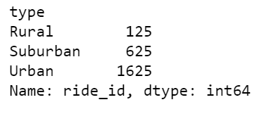

# PyBer_Analysis
## Overview 

- Determine ride sharing data within different types of cities and demographics, In doing so the following was used Python, Matplotlib, CSV, Panda Dataframes and conversions. 

## Purpose 

To provide client with a visualized and data view point for ride sharing within the city and the affect of it. Analyzing the drivers, rides, fares and types of cities, will provide an accurte number of the amount of rides each day was successfully executed. This data will also represent any additional income for the drivers ect. 

## Results 
First we will provide the customer with the break down of the amount of rides. 

- Total rides 

- Total amount of Drivers 

- Total amount in Fares

- The average per ride 

- Average fare per driver 

-Total Fare by Demographic 

- Summary Visualization 

- Urban cities generate the more profit !
- The data supports Urban cities pay far less per ride, leading to the drivers to make less
- Rural areas are more underserved and consumers in that area will pay more in fares as apposed to being in Urban or Suburban areas. 

## Summary 

- Improving access to PyBer service in those areas will bring the right balance between better prices for more riders to join in and the right amount charge that will convince consumers to pick PyBer, as the first choice of transportation for a share service. 
 
- As displayed by the data a high number of drivers and rides will show transperancy with medium to low fare.

-Increasing the cost of rides in the Urban area will proive the market a considerably larger  market and a small increase in the cost per ride could pay huge profit. 

-Rural city areas seem to have low fare value, an option would be to raise the fares and allow farther distances of driving. This would lock in the drivers next hour or so and provide a steady more secure stream for the driver and will benifit the consumer. 
